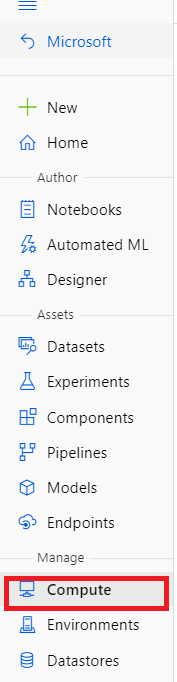
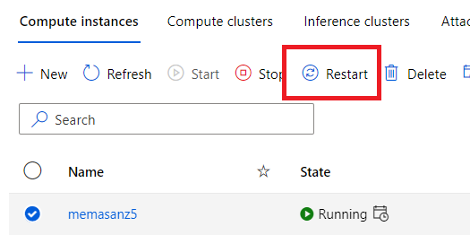
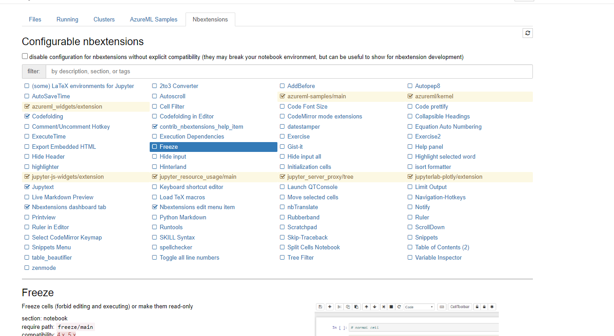

Using NB Extensions on Azure ML Compute Instance
================================================

Navigate to your compute instance



Select the terminal


```
pip install jupyter_contrib_nbextensions

jupyter contrib nbextension install --user

conda install -c conda-forge jupyter_nbextensions_configurator
```

**Reboot Machine**




